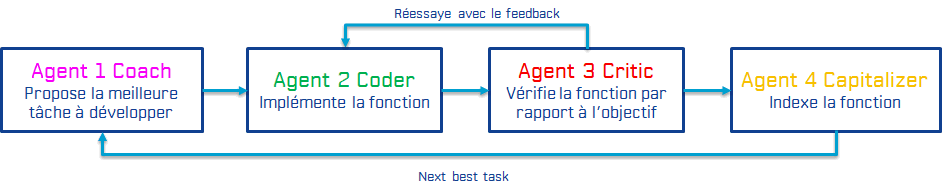
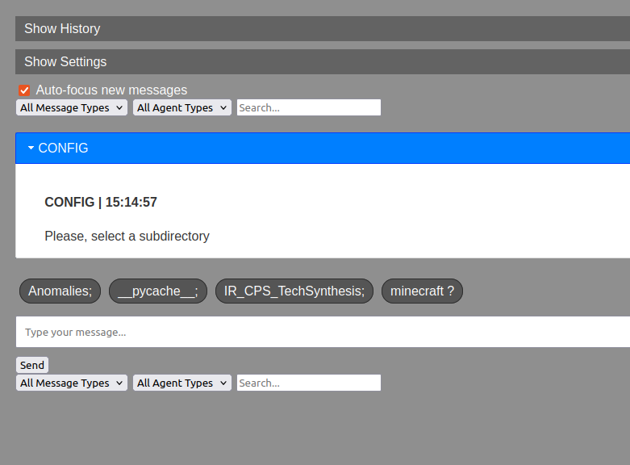
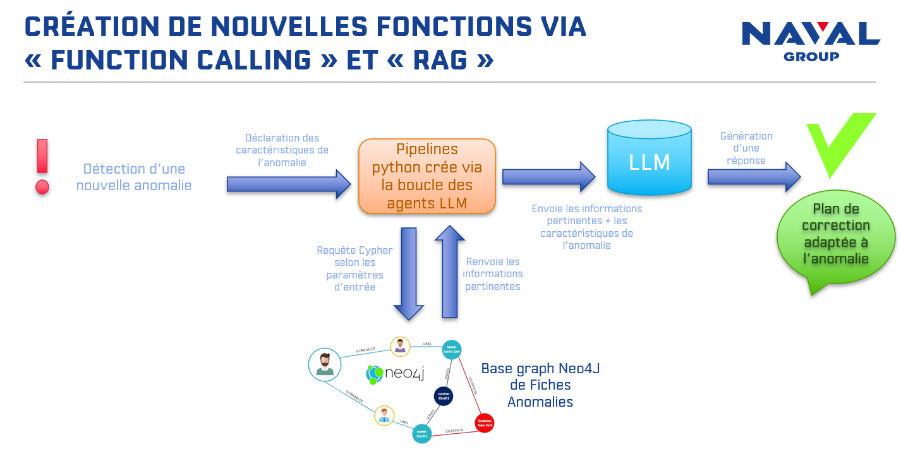
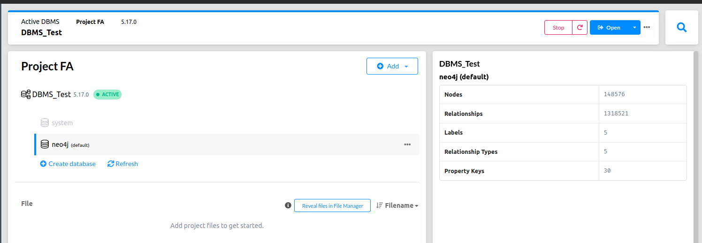
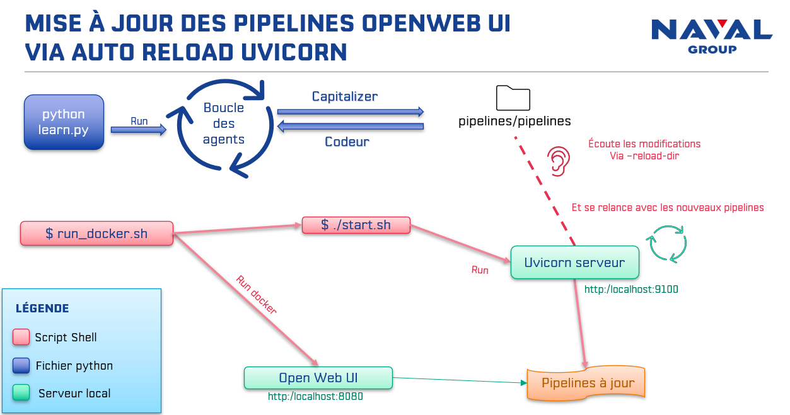

# Collab HumanLLM Functions Creation XP 2024

## Basic Architecture

This project enables the collaborative development of new functions using a language models loop (LLMs). It integrates human-LLM interaction mechanisms to track results, and provides feedbacks at each step of the loop to creat the best new functions, and pipelines possible. The system facilitates the iterative process of task proposal, coding, validation, and refinement, helping users to create advanced features through a mix of human and AI collaboration.


- **Database (Documentary and Vectorial)**: ElasticSearch stores trial results, new functions, and pipelines, integrating with Kibana for visualization.
- **Capacity/Functions Development Agent System**: `learn.py` manages the iterative process of task proposal, coding, validation, and capitalization.



## Prerequisites 

- Python 3.10+
- Venv or Conda env
- VSCode


## Installation

```bash
python -m venv venv
source venv/bin/activate
pip install -r requirements.txt
```

MODIFY CONFIG.PY with the IP that will be given to be able to access the local ElasticSearch data server

## Launching the learning to develop new functions

To start the collaborative development process on local IHM for new commands, execute the command:

```bash
python learn.py
```
You can start creating functions or pipelines by using **Jquery_front/IHM.html**



### Principles

1. **Proposal for New Task**: Adapt the proposed task or the agent's role.
2. **Code Proposal**: Adapt the code or the agent's role.
3. **Critique Proposal**: Modify the critique or correct the agent's role.
4. **Proposal for Task Indexing Description**: Correct the description or the agent's role.

---

## Detailed Functionality

The system allows human interaction both BEFORE and AFTER each inference to refine the collaboration with the LLM.
 - **Before** inference, users can adjust prompts, provide additional context, and set specific instructions to guide the model’s output.

 - **After** inference, humans can review the generated results, critique them, and make adjustments to improve the quality and relevance of the responses. 
 
This continuous feedback loop ensures that the model’s outputs align more closely with the user’s objectives, enabling a more tailored and effective collaboration between human input and AI processing.

*Human LLM Mechanism*: (TO EDIT CODE OR TEXT: a file is automatically opened in VSCode, it is by closing it that the text is validated and the process continues)

### Before Inference

1. **Select Subdirectory**: Choose the subdirectory to load prompts and the primitive folder. This helps in organizing and accessing relevant tasks and data.

2. **System Prompt Modification (A)**: Allows modification of the system prompt, global context, constraints, and output schema. This ensures that the agent’s responses are tailored to the specific requirements of the task.

3. **Add Instruction to Agent (B)**: Enables adding additional instructions or information to the agent. This helps in refining the agent’s output by providing it with more context or specific directions.

4. **Reuse Past Outputs (C)**: Set the new LLM output inference by reusing past outputs or defining it manually as example. This maintains consistency and leverages previous responses to improve current tasks.

5. **Log Comments (D)**: Logs comments about the current interaction for future reference. This helps in tracking feedback and making necessary adjustments.

6. **View All Previous Results (E)**: Displays all previous results for the agent. This provides a comprehensive history of responses for analysis and improvement.

7. **View Modified/Scored/Commented Results (F)**: Shows only the results that have been modified, scored, or commented on. This focuses on the most relevant data for refining the agent’s performance.

8. **Skip Human Actions for N Rounds (G)**: Skips human intervention for a specified number of rounds. This automates repetitive tasks and speeds up the development process.

9. **Change Default LLM (H)**: Changes the default LLM used by the system. This is useful for testing different models and selecting the one that best fits the task.

10. **Change Premium LLM (I)**: Changes the premium LLM used by the system. This allows for the use of higher-performing or specialized models.

11. **Change Number of Parallel Inferences (J)**: Adjusts the number of parallel inferences and enables/disables synthesis mode. This optimizes resource usage and processing time.

------------------------

### After Inference

1. **Modify Answer/Output (A - After)**: Allows manual adjustments to the output if it doesn’t meet the desired criteria.

2. **Criticize and Improve Output (B - After)**: Provides critiques to refine and enhance the output. This helps in continuously improving the agent’s responses.

3. **Find Better Prompt (C - After)**: Identifies a more effective prompt based on the current output and feedback. This ensures that the prompts used are optimized for the best results.

4. **Automatic Score Display**: Automatically displays scores to evaluate the quality of responses. This helps in quickly assessing performance and making necessary adjustments.

5. **Evaluate & Comment (D - After)**: Assesses and comments on answers to provide detailed feedback and guide future improvements.

6. **Go Back to Before Inference (E - After)**: Reverts to the state before inference to make changes or corrections. This allows for adjustments without starting from scratch.

------------------------

### General Features

1. **Tag Few-Shots**: Labels examples that use few-shot learning to improve the model’s performance with minimal data.

2. **Inference Stream Output**: Displays the output from the inference process in real-time for monitoring and adjustments.

3. **Synthesize Responses**: Combines multiple inference outputs into a single, coherent response.

4. **Apply Structured Output (Task Identification Agent & Coding Agent)**: Uses a structured output schema to organize and categorize tasks and responses effectively.

5. **Dynamic LLM Configuration**: Configures the LLM with specific parameters like temperature. Test various temperatures (e.g., 0 vs. 1) with multiple inferences to validate optimal settings.

6. **Custom Score**: Allows users to inject custom scoring and state retrieval functions. Ensure these functions are correctly integrated and executed for accurate performance evaluation.

7. **Switching Tasks**: Handles scenarios where multiple tasks are identified, allowing users to select the most relevant task or auto-select based on predefined criteria.

8. **Initial Agent Skip Round Management**: Manages scenarios where agents can skip a certain number of rounds, ensuring that this logic works correctly and doesn’t disrupt task flows.

9. **Task Failure Capitalization**: Captures and manages failed tasks to avoid repeating unsuccessful attempts and ensures they are correctly logged for future task selection.

10. **Validation Mode Switching**: Ability to switch between automatic and manual validation modes, verifying that the correct execution path is followed based on the mode.

11. **Environment Reset Option**: Resets the environment after completing a task or before starting a new one, providing a fresh context for task execution.

---

# Pipeline integration for Anomalies Solver

A special environnement has recently been add to the current loop. By creating pipelines instead of functions, and by loading it immediatly on OpenWebUI plateform, it will allow users to solve Anomalies dependning on its personnal labels such as : title, abstract, comments...
Thanks to the connection to a Neo4j database which containts all of the previous anomalies, pipelines are able to solve new anomalies by using RAG method (Retrieve Augmeneted Generation)





### Requirements

Download the pipelines repository from GitHub: 

```bash
git clone https://github.com/open-webui/pipelines.git
```

###  Launch Neo4J database load on your machine 


### Launch OpenWebUI with Docker 

#### Launch it automaticcaly by shell script : ```bash run_docker.sh ```

(it launches the OpenWebUI Docker container, the `start.sh` script which loads the pipelines, and the Uvicorn servers that monitor any modifications made to `/pipelines/pipelines` directly).



#### Launch it manually without ollama :
```bash   
    docker run -d -p 3000:8080 --add-host=host.docker.internal:host-gateway -v open-webui:/app/backend/data --name open-webui --restart always ghcr.io/open-webui/open-webui:main
```
Watch on : ```http://localhost:3000 ```
        
NB: if ```--add-host=host.docker.internal:host-gateway``` does not work, please use host IP to connect OpenWebUI interface.


#### Launch it manually with ollama : 
```bash
    docker run -d   --network=host   -v open-webui:/app/backend/data   --add-host=host.docker.internal:host-gateway   -e PIPELINES_URLS="$(for file in /pipelines/pipelines/*; do echo -n "$file,"; done | sed 's/,$//')"   -e OLLAMA_BASE_URL=http://127.0.0.1:11434   -v /path/to/pipelines:/app/pipelines   --name pipelines-combin   --restart always   ghcr.io/open-webui/pipelines:main
```

Watch on : ```http://localhost:8080```     


### OpenWebUi settings


###### With Ollama 

the WebUI docker container may not being able to reach the Ollama server at 127.0.0.1:11434 (host.docker.internal:11434) inside the container . Use the --network=host flag in your docker command to resolve this. Note that the port changes from 3000 to 8080, resulting in the link.

open http://localhost:8080, register or login, and then in Admin Panel, set the following mandatory connections: 

    https://api.openai.com/v1   (add your personnal openai key)

    http://localhost:9100   pwd : 0p3n-w3bu!

NB: if you use docker  : http://host.docker.internal:9100   pwd : 0p3n-w3bu!

    http://localhost:11434 for ollama

    
depending on the pipelines valves, you may have to fill the missing connections informations, such as :

                Llamaindex Ollama Base Url              http://localhost:11434
                Llamaindex Model Name                   llama3_8b
                Llamaindex Embedding Model Name         nomic-embed-text
                Neo4J Uri                               bolt://localhost:7687
                Neo4J User                              neo4j
                Neo4J Password                          password
                Openai Api Key                          your-key-api

The validated functions that we will capitalize are placed in the **functions directory** or **pipelines/pipelines**
Prompts contain the "system prompts" sent to agents but it is much preferable to modify them from learn.py (via the Human LLM mechanism). \
